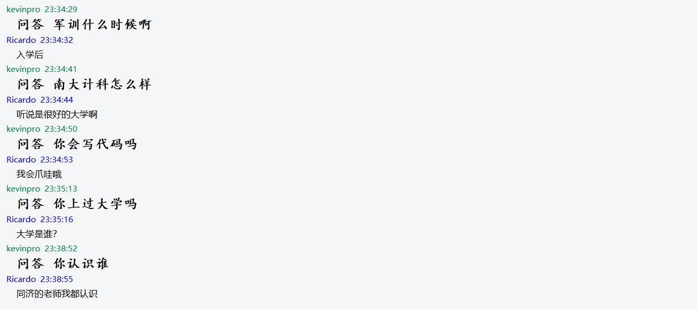

# KevinproQQBot

基于NoneBot的实现的QQ机器人，欢迎PR，提交新的插件

本项目自然语言处理内核：[Ricardokevins/Kevinpro-NLP-demo: 个人的NLP实践demo，包含了分类，对话机器人，文本摘要，关系抽取以及对抗训练，知识蒸馏等pytorch实现 (github.com)](https://github.com/Ricardokevins/Kevinpro-NLP-demo)


# 主要框架

```
gocqhttp                          
Kevinpro                          
	bot_plugins                   
		dialogue.py              
		ping.py                   
		weather.py                
		zhihutop.py
        NJUQA.py
	services                      
		...略
	bot.py                       
	bot_config.py               
	
```


# 已经实现：

1. 获取天气
2. 简单的英文对话
3. 获取知乎Top10热搜
4. 增加了答疑聊天数据，以及外部中文对话语料数据（参考2）


## 测试




# 待实现

1. 更多的NLP算法迁移和融合
2. 更加智能的问答，包括中文支持
3. 引入图片等资源
4. 引入知识图谱等后台数据库


# 参考链接

感谢如下的所有参考资源

参考1：NoneBot

参考2：语料来源：[codemayq/chinese_chatbot_corpus: 中文公开聊天语料库 (github.com)](https://github.com/codemayq/chinese_chatbot_corpus)

参考3：本项目的主要入门链接：[使用 nonebot 搭建 qq 群聊机器人 - 知乎 (zhihu.com)](https://zhuanlan.zhihu.com/p/340849952)